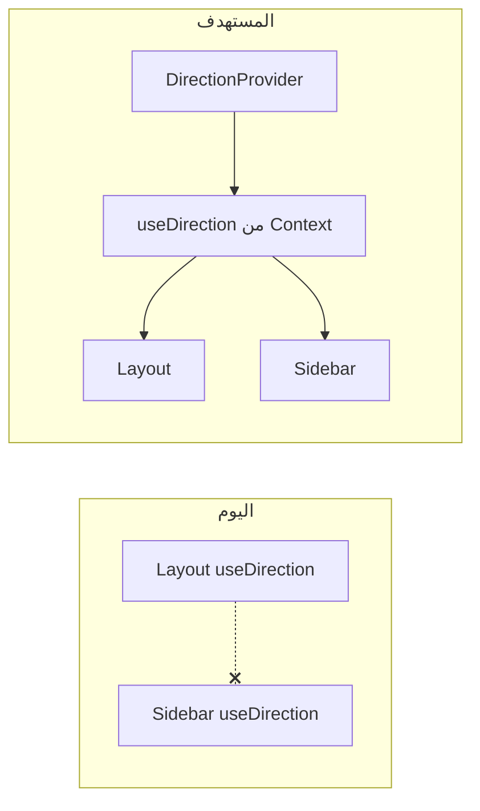

# خطة: عربية + RTL + لودر، وسجل ملاحظات على الكيانات (`apps/web` و backend)

## الوضع الحالي (ملخص)

- يوجد تبديل اتجاه عبر [`apps/web/src/lib/useDirection.ts`](apps/web/src/lib/useDirection.ts): يكتب `dir` و`lang` على `document.documentElement` ويُحدّث Tailwind المنطقي (`ms-`/`me-`) حيثما يُستخدم.
- [`apps/web/src/index.css`](apps/web/src/index.css) يحتوي قواعد جاهزة لـ `html[dir="rtl"]` (عناوين، جداول، خطوط عربية).
- [`apps/web/src/components/layout/Layout.tsx`](apps/web/src/components/layout/Layout.tsx) و[`Sidebar.tsx`](apps/web/src/components/layout/Sidebar.tsx) يضعان `dir`/`lang` على حاويات محلية؛ الروابط في الشريط تستخدم أزواج `title` / `arabicTitle`.
- صفحات كثيرة (مثل [`WoodOrders.tsx`](apps/web/src/pages/WoodOrders.tsx)) نصوصها بالإنجليزية فقط؛ الترجمة الآن غير متماسكة (بعض الصفحات مثل [`Dashboard.tsx`](apps/web/src/pages/Dashboard.tsx) تستخدم `rtl ? "..." : "..."`).
- **خلل معمارية**: `useDirection` ليس Context — كل استدعاء له `useState` مستقل؛ عند الضغط على التبديل في `Layout` قد تبقى حالة `Sidebar` / `Dashboard` غير متزامنة مع ما يظهر في الرأس. يجب توحيد المصدر قبل توسيع الترجمة.

## 1) توحيد اللغة والاتجاه (إلزامي قبل i18n)

- إضافة **Provider** في [`apps/web/src/main.tsx`](apps/web/src/main.tsx) يلف `App` (مثل `PermissionProvider`): يحتفظ بـ `direction` و`setDirection`/`toggle` مرة واحدة.
- إعادة كتابة [`useDirection.ts`](apps/web/src/lib/useDirection.ts) ليقرأ من Context (مع `useContext` + رسالة واضحة إن وُجد استخدام خارج الـ Provider).
- اختياري لمنع وميض الاتجاه: في [`index.html`](apps/web/index.html) سكربت صغير يقرأ `factory-data-hub:direction` ويضبط `dir`/`lang` على `<html>` قبل hydration (نمط مشابه لسكربت `data-theme` الموجود).

**مبدأ ربط اللغة بالاتجاه**: يبقى الافتراضي الحالي — `rtl` ⟺ `ar`، `ltr` ⟺ `en` — ما لم تُفصل لاحقاً «لغة واجهة» عن «اتجاه العرض» (غير مطلوب الآن).

## 2) طبقة ترجمة لكل المحتوى الظاهر للمستخدم

- إضافة **`i18next` + `react-i18next`** (غير موجودة في [`package.json`](apps/web/package.json)) مع تهيئة في ملف مثل `apps/web/src/i18n/config.ts` واستدعائها مرة من `main.tsx`.
- ملفات موارد: على الأقل [`apps/web/src/locales/en.json`](apps/web/src/locales/en.json) و[`apps/web/src/locales/ar.json`](apps/web/src/locales/ar.json)؛ تقسيم منطقي اختياري (`common`, `nav`, `woodOrders`, …) عبر namespaces أو بادئات مفاتيح.
- استبدال تدريجي:
  - السلاسل فى **كل الصفحات** تحت [`apps/web/src/pages/`](apps/web/src/pages/)
  - المكوّنات المشتركة: [`apps/web/src/components/data-table/`](apps/web/src/components/data-table/)، حوارات [`Dialog`](apps/web/src/components/ui/)، رسائل الخطأ، أزرار التصدير، [`RouteCoach`](apps/web/src/components/coaching/) إن كان نصه ثابتاً
  - ثوابت عرضية مثل تسميات المراحل في [`apps/web/src/data/routing.ts`](apps/web/src/data/routing.ts) / أنواع الحالة: إما حقول `labelEn`/`labelAr` أو مفتاح i18n لكل قيمة؛ العرض يمر عبر `t(...)`.
- إبقاء البيانات القادمة من الـ API كما هي؛ الترجمة تطبَّق عند العرض (ما لم يُطلب تعريب قيم النطاق لاحقاً في الخادم).

## 3) RTL وتنسيق الصفحات

- الاعتماد على `document.documentElement` و[`index.css`](apps/web/src/index.css) كطبقة أساسية.
- مراجعة الصفحات التي تفرض `dir="ltr"` على أقسام كاملة (مثل أجزاء من [`PermissionsAdmin.tsx`](apps/web/src/pages/PermissionsAdmin.tsx)): الإبقاء فقط حيث يلزم (أكواد، مسارات، معرفات) وعرض النص العربي تحت `rtl` عند اختيار العربية.
- تدقيق **`flex`/`justify`/`text-start`/`end`/`rounded-*`/`border-*`**: استبدال ما يزال فيزيائياً (`left`/`right`/`pl`/`pr` حيث يؤثر على المرآة) بخصائص منطقية أو فئات شرطية `rtl:` في Tailwind عند الحاجة.
- **الشريط الجانبي** في [`Sidebar.tsx`](apps/web/src/components/layout/Sidebar.tsx) ثابت على `right-0` — هذا قرار تصميم؛ الهامش على المحتوى الرئيسي يبقى **`margin-right`** (أو ما يعادل عرض الشريط على الجانب الأيمن الفيزيائي) حتى لا تُعكّس الهامش خطأً مع `margin-inline-*` عند `dir=rtl`.

## 4) رأس الصفحة، التذييل، وتجليل التنقل

- [`Layout.tsx`](apps/web/src/components/layout/Layout.tsx): النصوص الحالية في الهيدر/التذييل بالعربية فقط؛ ربطها بـ `t` بحيث عند `en` تظهر نسخة إنجليزية، و`aria-label` للشعار والأزرار مترجمة.
- [`Sidebar.tsx`](apps/web/src/components/layout/Sidebar.tsx): استبدال أزواج `title`/`arabicTitle` بمفتاح i18n واحد (أو `t('nav.xxx')`) لتقليل التكرار.
- [`AuthHeaderLinks.tsx`](apps/web/src/components/layout/AuthHeaderLinks.tsx): نفس الأمر.

## 5) تواريخ وأرقام (حسب الحاجة)

- دوال مثل `formatDate` في الصفحات: استخدام `Intl.DateTimeFormat(locale)` حيث `locale` من حالة اللغة (`ar`/`en`).
- الأرقام المعروضة للمستخدم: عند الحاجة `Intl.NumberFormat` بنفس الـ locale.

## 6) أنيميشن وترانزيشن خفيفة ولودر الشعار

**الهدف**: إحساس تطبيق أنيق دون بطء أو حركة مزعجة؛ احترام `prefers-reduced-motion` (المشروع يستخدم بالفعل `MotionConfig reducedMotion="user"` في [`Layout.tsx`](apps/web/src/components/layout/Layout.tsx)).

- **ترانزيشن عامة**: تقصير/توحيد مدة الـ fade أو الـ slide للمحتوى داخل [`Layout`](apps/web/src/components/layout/Layout.tsx) (مثلاً 0.25–0.35s، easing واحد متسق)؛ يمكن إضافة `transition` خفيف على `glass-panel`/الحدود في [`index.css`](apps/web/src/index.css) عند `hover`/`focus` حيث يناسب التصميم الصناعي.
- **حالات التحميل الطويلة**: مكوّن مركزي مثل `BrandLogoLoader` أو `LoadingOverlay` في [`apps/web/src/components/brand/`](apps/web/src/components/brand/) (أو `ui/`) يعيد استخدام [`BrandLogo.tsx`](apps/web/src/components/brand/BrandLogo.tsx) مع:
  - طبقة شبه شفافة `backdrop-blur` و`aria-busy`/`role="status"` ونص مخفي للقارئ (`sr-only`) مترجم عبر i18n.
  - حركة خفيفة: `opacity` pulse أو `scale` ضيق (مثلاً 0.97–1) بـ CSS `@keyframes` أو `motion` من `framer-motion` مع تعطيل عند تقليل الحركة.
- **أين يُربط**: نقاط `useQuery`/`useMutation` ذات `isFetching`/`isPending` الطويلة (جداول كبيرة، تصدير، حفظ دفعي) — إما شريط تقدّم موضعي فوق الجدول أو overlay كامل الصفحة عند العمليات التي تتجاوز عتبة زمنية (مثلاً >300ms) لتفادي الوميض؛ استخدام نفس اللودر في مسارات الصفحة الأولى إن لزم.

## 7) تحقق يدوي

- مسار تسجيل الدخول، لوحة التحكم، أوامر الخشب/المعادن، جداول مع تمرير أفقي، نماذج الحفظ/الحذف، وصفحة الصلاحيات.
- التبديل بين `LTR · English` و`RTL · عربي` والتأكد من: تحديث الشريط، العناوين، الأزرار، وعدم بقاء نص إنجليزي في الوضع العربي (حسب نطاق الملفات المُستخرجة).
- الملاحظات: إنشاء/عرض/تعديل/حذف لكل نوع كيان مفعّل، واحترام الصلاحيات ونطاق البيانات.
- عمليات بطيئة: ظهور لودر الشعار، عدم حجب التفاعل دون داعٍ، وسلوك مقبول عند تفعيل «تقليل الحركة» في النظام.

## 8) سجل ملاحظات على الكيانات (موظف، ماكينة، مشروع، أمر شغل، …)

**الهدف**: تمكين المستخدم من إضافة **عدة ملاحظات مؤرخة** (ليست حقلًا نصيًا واحدًا فقط) مرتبطة بكيان محدد، مع إظهارها في الواجهة بشكل موحّد.

**الوضع الحالي**: حقل `notes` موجود على بعض أوامر المعدن في [`lib/db/src/schema/metalWorkOrders.ts`](lib/db/src/schema/metalWorkOrders.ts) كجزء من سطر الأمر؛ أوامر الخشب في Factory Hub تُخزَّن كـ JSON في [`fhWoodWorkOrdersTable`](lib/db/src/schema/factoryHub.ts). جداول [`employees`](lib/db/src/schema/employees.ts)، [`tasksTable`](lib/db/src/schema/factoryCapacity.ts) (مهمة/ماكينة ضمن السعة)، [`sharedProjectsTable`](lib/db/src/schema/sharedProjects.ts) لا تحتوي سجل ملاحظات منفصل.

**النموذج المقترح (جدول موحّد)** مثل `entity_notes`:

- `id`، `entity_type` (قيم مُحدَّدة في الكود: `employee`، `task`، `department`، `factory`، `shared_project`، `wood_work_order`، `metal_work_order`، … مع إمكانية التوسعة)، `entity_id` (نص يطابق المفتاح الأساسي للكيان في الجداول الحالية)، `body`، `created_at`، `updated_at`، واختياريًا `created_by_user_id` / `updated_by_user_id` إن وُجد مستخدم في السياق ([`RequestAuth`](artifacts/api-server/src/lib/requestAuth.ts) من نوع `user`).

**Backend**: خدمة + مسارات REST تحت بادئة مثل `/notes` أو `/entity-notes` مع فلترة `entity_type` + `entity_id`؛ **الصلاحيات**: ربط إنشاء/قراءة/حذف بسياسة موجودة (`requirePermission`) و**نطاق البيانات** بحيث لا يقرأ المستخدم ملاحظات كيان خارج نطاق مصنع/قسمه إن كان النظام يفرض ذلك على الكيان الأصلي.

**Frontend**: مكوّن `EntityNotesPanel` (قائمة زمنية + إدخال جديد + تعديل/حذف حسب الصلاحية) مع نصوص عبر i18n واتجاه RTL؛ دمج تدريجي في الشاشات ذات الصلة (مثل أداء الأفراد، سجل المعدات/المهام، المشاريع المشتركة، تفاصيل/صفحة أمر الشغل خشب ومعدن). الحقول القديمة مثل `notes` في أمر المعدن يمكن الإبقاء عليها للاستيراد والعرض السريع، مع إمكانية **ترحيل اختياري** لمحتوى الحقل القديم كأول سجل في `entity_notes` لاحقًا.

**ترتيب فرعي**: مخطط DB → API + اختبارات يدوية → مكوّن UI مشترك → دمج لكل نوع كيان مع التحقق من الصلاحيات.

## ترتيب التنفيذ المقترح

1. `DirectionProvider` + إصلاح `useDirection`.
2. إعداد `i18next` وملفات `ar`/`en`.
3. استخراج النصوص من الشريط والـ Layout ثم الصفحات عالية الكثافة (`WoodOrders`, `MetalOrders`, `DailyProduction`, `Analytics`, …).
4. مراجعة RTL ومواءمة الفئات المنطقية.
5. **لودر الشعار + تنعيم الترانزيشن** (يمكن موازاته مع خطوة 3–4 على صفحات ذات تحميل ثقيل).
6. **سجل الملاحظات**: مخطط → API → `EntityNotesPanel` → دمج بالصفحات حسب أولوية العمل.
7. تمرير أخير على التواريخ/الأرقام والاختبارات اليدوية (يشمل اللغة/RTL/اللودر/الملاحظات).
