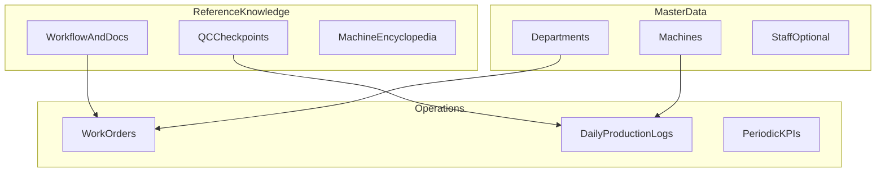

# خطة دمج بيانات إبداع (Ebdaa) مع نظام Factory Data Hub

## 1. ملخص ما في المجلد (جرد ذات مغزى)

| الطبقة | الملفات (Arabic names on disk) | مضمون مختصر |
|--------|----------------------------------|-------------|
| **سجل ماكينات موحد + هويات** | `تقرير_شامل_جميع_الماكينات_Tajawal.docx`, `تقرير_الماكينات_النهائي_Tajawal.docx`, `تقرير_نهائي_شامل_للماكينات.docx` | خط HOMAG للمصنع F01: مناشير SAWTEQ، EDGETEQ S-500، DRILLTEQ V-200، CenTa E-300 / P-110 (5 محاور)، مكابس، صنفرة، تشكيل، كمبرسرات KAESER، مع **أرقام تسلسلية** وجداول صيانة وتوصيات تشغيلية. |
| **مواصفات بديلة / تعارض محتمل** | `تقرير_شامل_الماكينات_بالعربي.docx`, `تقرير_مواصفات_الماكينات_التفصيلي.docx`, ورقة `دليل_الماكينات_الشامل_بالمواصفات.xlsx` (Sheet1) | نصوص تفصيلية حول **SCM Nova SI 400** ومقارنات HOMAG؛ لا تطابق الأسماء مع تقارير Tajawal للمنشار — يحتاج **قرار مصدر حقيقة واحد** قبل التحميل كـ master data. |
| **دليل تشغيل وسير عمل** | `دليل_إدارة_خط_الإنتاج.docx`, `خطة_سير_العمل_والمستندات.xlsx` | مسار: مبيعات → مشروعات → مكتب فني (DXF) → تخطيط → صرف خامات → تقطيع → لصق شريط → CNC → جودة → تجميع → تغليف → مخزن/شحن؛ وثائق (أمر شغل، إذن صرف، إذن ترحيل) و**نقاط تفتيش**. |
| **تشغيل يومي / دوري** | `نظام_متابعة_الإنتاج_اليومي.xlsx`, `المتابعة_الدورية_الشاملة.xlsx`, `نظام_تتبع_الفنيين_الشامل.xlsx` | أعمدة KPI (مشاريع، جودة، ساعات تشغيل، إلخ)؛ قيم كثيرة **صفر / فارغة** — هياكل جاهزة كقوالب وليس كبيانات محملة. |
| **عمالة** | `حصر_وتقييم_العمالة.xlsx` | حصر بالأقسام، فجوات توظيف، ورقة تقييم فيها **`#DIV/0!`** تحتاج تصحيحاً قبل الاعتماد. |
| **سجل ماكينات قابل للتحديث** | `سجل_الماكينات_والمواصفات.xlsx` | جداول صيانة وقطع غيار؛ حقول «يرجى إضافة الموديل» — **تمهيدي** مقابل التقارير Word الغنية. |
| **دفاتر مساعدة** | `نماذج_عمل_إضافية.xlsx` | مشاكل/حلول، اجتماعات، تحسين مستمر، طلب خامات، هدر، لوحة KPI — مناسبة كـ **عمليات مستقبلية** أو نماذج تصدير. |
| **ROI وإدارة** | `مقترح_ROI_للإدارة_Tajawal.docx`, `مقترح_للإدارة_ROI.docx`, `نظام_ROI_العائد_على_الاستثمار.xlsx`, `ملخص_تنفيذي_النظام.docx` | محتوى إقناع إداري + حاسبة؛ الأرقام (مثلاً ROI ~133%) **افتراضية** للعرض وليست قياساً آلياً من النظام. |
| **Excel مشكوك** | `دليل_الماكينات_الشامل.xlsx`, `دليل_الماكينات_النهائي_الشامل.xlsx` | عند القراءة البرمجية ظهرت أوراق بلا نصوص مشتركة كافية؛ يُفترض أنها تعتمد على تنسيق/أرقام فقط أو بنية مختلفة — **مراجعة يدوية في Excel** قبل الدمج أو الاستبعاد. |

## 2. قرارات «ماذا نبقي وماذا نستثني» (نقرر معاً)

- **مصدر حقيقة الماكينات (قرار حاسم):**
  - **خيار A:** اعتماد خط **HOMAG + الجدول ذي الـ21 صفًا** في `تقرير_شامل_جميع_الماكينات_Tajawal.docx` كمصدر وحيد للمعرفات التسلسلية والأقسام.
  - **خيار B:** الإبقاء على نصوص **SCM** كمرجع تقني منفصل (صفحة «مقارنة/بدائل») دون استخدامها كسجل تشغيل افتراضي.
  - **خيار C:** التحقق الميداني من لوحات البيانات ثم دمج النتيجة في النظام.

- **حساسية البيانات:** الأسماء الوصفية للعمالة، الأرقام التسلسلية، وأرقام ROI — إما **بيئة داخلية كاملة** أو **إخفاء جزئي** في الواجهة العامة/التصدير.

- **التكرار بين ملفات Word:** أربعة تقارير ماكينات + مقترحان ROI متشابهان؛ مقترح العمل: **واحد مرجعي لكل نوع** في الواجهة، والباقي أرشيف في المجلد فقط.

## 3. هيكلة البيانات المقترحة (Conceptual)

- **`Machines`:** `serial`, `model`, `name_ar`, `section`, `notes`, `criticality` (مثل راوتر 5 محاور).
- **`WorkflowStage`:** يطابق صفوف `خطة_سير_العمل` ويربط بمراحل الخشب الحالية في [`apps/web/src/data/routing.ts`](c:\Data\Factory-Data-Hub\apps\web\src\data\routing.ts) (`panel_saw`, `edge_banding`, `cnc_routing`, `assembly`, `packaging`, …) مع جدول **تحويل صريح** لأن الدليل النصي يذكر «جودة» كمرحلة منفصلة بين CNC والتجميع.
- **`DocumentRequirement` / `QCCheckpoint`:** من الأوراق 2–3 في `خطة_سير_العمل_والمستندات.xlsx`.
- **`OperationalTemplates`:** تعريف أعمدة Excel كـ TypeScript types مشتركة مع ما ي exists في [`dailySheet`](c:\Data\Factory-Data-Hub\apps\web\src\lib\dailySheet.ts) لتقليل الازدواجية لاحقاً.

## 4. ربط بالتطبيق الحالي

- التوجيه موجود في [`App.tsx`](c:\Data\Factory-Data-Hub\apps\web\src\App.tsx): لوحة، أوامر خشب، إنتاج يومي، مشاريع، تحليلات؛ **`/planning` يعرض [`PlanningKpi`](apps/web/src/pages/PlanningKpi.tsx) (لوحة KPI دورية) بدل placeholder السابق**.
- التذييل: [`Layout.tsx`](c:\Data\Factory-Data-Hub\apps\web\src\components\layout\Layout.tsx) يعرض بالفعل «Created by **Yasserious.com**» — يمكن توحيد النص ثنائي اللغة أو إضافة سطر عربي تحت المحتوى إذا رغبت بصياغة أخرى دون تكرار في كل صفحة على حدة.

**مسار تكامل مقترح بالمراحل:**

1. **مرحلة المعرفة الثابتة:** صفحة جديدة مثل `/about-system` أو `/help` (محتوى من `ملخص_تنفيذي_النظام.docx` + `دليل_إدارة_خط_الإنتاج.docx`) مع أقسام: الماكينات، سير العمل، الوثائق، التدريب، الأسئلة الشائعة، و«ابدأ من هنا».
2. **مرحلة البيانات:** تحويل جدول الـ21 ماكينة إلى **fixture JSON** واحد (`apps/web/src/data/…`) أو migration لاحق لـ DB؛ ربط العرض بصفحة «المعدات» أو قسم في لوحة الخشب.
3. **مرحلة العمليات:** توسيع `/daily/wood` أو نموذج مستقبلي لالتقاط أعمدة `نظام_متابعة_الإنتاج_اليومي.xlsx`؛ **`/planning`** كلوحة للمتابعة الدورية بدل تكرار Excel يدوياً.
4. **مرحلة الموارد البشرية والمالية:** تأجيل أو عزل ROI والرواتب التقديرية في قسم «إداري» حتى توجد وحدة مالية/صلاحيات.

## 5. محتوى تعليمي وتدريبي (جاهز كنصوص للواجهة)

**وحدات تدريب مقترحة (45–60 دقيقة إجمالاً مقسمة):**

1. **تعريف النظام:** الغرض، الفرق بين لوحة التحكم وأوامر الشغل والإنتاج اليومي.
2. **مسار أمر الشغل الخشبي:** ربط المراحل في التطبيق بدلالة الدليل الورقي.
3. **الوثائق ونقاط التفتيش:** متى يُوقَّع إذن الترحيل؛ معايير ±2 مم للتقطيع من الجداول.
4. **المعدات الحرجة:** راوتر 5 محاور، V-200، أهمية الصيانة اليومية (من التقارير).
5. **التقارير والتصدير:** استخدام التصدير اليومي الحالي كخطوة أولى قبل أتمتة كاملة.

**مكتبة رسائل Toast / تلميحات سياقية (أمثلة قابلة للربط بالمسار):**

| السياق | رسالة عربية مقترحة |
|--------|---------------------|
| `/orders/wood` | «تحديث كميات المراحل يعكس التقدّم على شريط الحالة؛ راجع تسلسل: مقاطع → لزق شريط → CNC.» |
| `/daily/wood` | «اليومية تُصدَّر كمرافق للأرضية؛ سجّل أمر الشغل والفني نفس خطة الإكسل اليومية.» |
| `/projects/new` | «قبل التخطيط: تأكد أن المكتب الفني جهّز ملفات DXF للتخريم كما في دليل سير العمل.» |
| `/planning` (عند التفعيل) | «المتابعة الأسبوعية تربط الإنجاز بالجودة؛ حدّث الأهداف بدل ترك الخلايا فارغة.» |
| عام بعد أول زيارة | «ابدأ من صفحة «حول النظام» لفهم الوحدات والمسؤوليات.» |

(التنفيذ الفني: توسيع [`Toast.tsx`](c:\Data\Factory-Data-Hub\apps\web\src\components\ui\Toast) أو إضافة `CoachMark`/`Banner` خفيف حسب الصفحة، مع تجنب الإزعاج.)

## 6. مخاطر وجودة البيانات

- **تعارض SCM vs HOMAG** — يمنع بناء سجل ماكينات موثوق دون قرار.
- **Excel بـ `#DIV/0!`** في تقييم الأداء — لا يُستورد كحقائق.
- **ملفات «فارغة» تقنياً** (`دليل_الماكينات_الشامل.xlsx`، …) — تحقق بصري قبل الحذف أو الأرشفة.

## 7. ما الذي لا يُنسخ حرفياً إلى الإنتاج بدون مراجعة

- أرقام ROI والرواتب التقديرية من مقترحات الإدارة.
- أي اسم شخص حقيقي إذا انتقل لبيئة عامة.
- القوالب ذات الخلايا الصفرية كـ «بيانات تاريخية».

---

**ملخص تنفيذي للمستخدم:** المجلد يمثل **حزمة تشغيل كاملة** (معرفة + قوالب Excel). أقوى قيمة للنظام الرقمي هي **توحيد سجل الماكينات مع Tajawal**، و**تعليم سير العمل وال QC في الواجهة**، ثم **محاكاة أعمدة الإنتاج اليومي** داخل التطبيق؛ بينما **ROI والتكرار الوثائقي** يُضغط أو يُؤجل إلى وحدة إدارية. التذييل لـ Yasserious.com **موجود** في التخطيط العالمي؛ يمكن تعزيزه بنص عربي موجز إذا رغبت.
