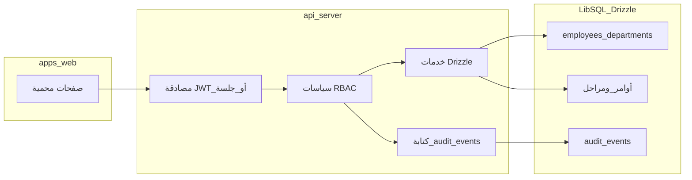

# خطة صلاحيات المستخدمين، ظهور البيانات، الإدخال، وسجل التحركات ومقارنة الأداء

## الوضع الحالي ذو الصلة

- الواجهة الرئيسية: [`apps/web`](apps/web) (React + Wouter) — لا توجد حاليًا جلسة مستخدم أو RBAC في الواجهة.
- البيانات المنظمة: [`lib/db/src/schema`](lib/db/src/schema) يحتوي [`employeesTable`](lib/db/src/schema/employees.ts) مرتبطة بـ [`departmentsTable` / `factoriesTable`](lib/db/src/schema/factoryCapacity.ts) — أساس جيد لربط المستخدم بالقسم والمصنع.
- الخلفية: [`artifacts/api-server`](artifacts/api-server) مسارات REST (`wooden`, `metal`, `factoryHub`, `employees`, …) بدون طبقة سياسات موحّدة موثّقة في الكود الذي تم مسحه.

## 1) نموذج الهوية والصلاحيات

**قرارات تصميم مقترحة**

- **مستخدم نظام** (`system_users`): معرف، بريد/اسم دخول، كلمة مرور مشفّرة أو ربط لاحق بمزود OAuth؛ حقل اختياري `employeeId` لربط السجل الوظيفي بـ `employees`.
- **أدوار** (`roles`): مثل `super_admin`, `factory_admin`, `department_lead`, `operator`, `viewer`.
- **صلاحيات دقيقة** (`permissions`) على شكل `resource` + `action` (مثلاً `wood_orders:read`, `wood_orders:write`, `daily_production:export`, `employees:read`).
- **ربط** `role_permissions` و `user_roles`؛ دعم **نطاق** اختياري: `factory_id` و/أو `department_id` لقيود صفّية (لا يرى القسم إلا ما يخص قسمه).

**فصل «عرض» عن «إدخال»**

- في الطبقة السياسية: دوال `can(user, action, resourceMeta)` حيث `resourceMeta` يتضمن مصنع/قسم/كيان محدد للتحقق من الإسناد.
- على مستوى API: وسيط موحّد بعد المصادقة يحقن `req.auth` ويرفض `403` قبل الوصول للـ controller.
- على مستوى الواجهة: إخفاء أو تعطيل عناصر الإدخال بناءً على نفس المصفوفة (مع اعتبار أن الحقيقة الأمنية على الخادم فقط).

## 2) ظهور البيانات (Data visibility)

- **تصفية استعلامات Drizzle** حسب نطاق المستخدم (مصنع/أقسام متعددة للمدير، قسم واحد للمشغّل).
- توثيق **جدول سياسات** لكل مورد (أوامر خشب/معدن، إنتاج يومي، مشاريع): أي عمود أو مجموعة بيانات تحتاج صلاحية إضافية (مثلاً تكاليف أو معلومات عملاء) كحقول `sensitivity` مستقبلًا إن لزم.

## 3) سجل التدقيق (Audit log)

**جدول مقترح** `audit_events` (append-only):

- `id`, `occurredAt`, `actorUserId`, `actorEmployeeId` (اختياري), `departmentId` (سياق القسم إن وُجد), `action` (مثل `CREATE`, `UPDATE`, `DELETE`, `EXPORT`, `LOGIN`, `LOGIN_FAILED`), `resourceType`, `resourceId`, `route` أو `endpoint`, `ip`, `userAgent`, `payloadSummary` (JSON مختصر أو hash)، واختياريًا `before`/`after` للكيانات الحساسة فقط لتجنب نمو حجم السجل.

**التطبيق**

- Middleware في [`artifacts/api-server/src/app.ts`](artifacts/api-server/src/routes) أو طبقة حول الخدمات لمسارات التعديل والاستيراد/التصدير.
- تسجيل **قرارات الرفض** (`403`/`401`) بحدّ معقول لمكافحة التسلل.

**شاشة السجل في الواجهة**

- مسار جديد محمي مثل `/audit-log` أو ضمن `/admin` (وفق خطة لوحة التحكم): جدول مع فلاتر (تاريخ، مستخدم، قسم، نوع الحدث، مورد)، تصدير CSV للمراجعين، وصفحة تفاصيل لحدث واحد.

## 4) مقارنة أداء الأقسام والأفراد

**مصادر مقاييس (مرحلة أولى واقعية)**

- استخدام بيانات الإنتاج الموجودة: تحديثات المراحل، أوامر الشغل، وسجلات مثل [`metalStageLog`](lib/db/src/schema/metalStageLog.ts) حيث تنطبق على المعدن؛ وتعريف مقاييس موازية للخشب من [`woodenProductionStages`](lib/db/src/schema/woodenProductionStages.ts) أو الحقول في Factory Hub إن كانت مصدر الحقيقة.
- **أداء القسم**: تجميعات زمنية (يوم/أسبوع): عدد الوحدات المكتملة، متوسط زمن الدورة، معدل الإنجاز، نسبة التأخير (إن وُجدت تواريخ مستهدفة).
- **أداء الشخص**: يتطلّب ربط **`employeeId`** أو معرف المُدخل في أحداث الإدخال/المراحل؛ إن لم يُسجَّل اليوم، خطوة تمهيدية: إضافة حقول `updatedByUserId`/`completedByEmployeeId` على التحديثات الحرجة أو استنتاج من سجل التدقيق للإجراءات ذات الصلة.

**شاشات**

- `/performance/departments`: مخططات ومقارنة بين أقسام المصنع/المصانع مع نفس الفترة.
- `/performance/people`: جدول ترتيب + اتجاهات لكل موظف مرتبط بالبيانات؛ احترام صلاحيات العرض (لا يرى كل الأفراد إلا من له دور إداري).

## 5) تسليم مرحلي مقترح

| المرحلة | المحتوى |
|---------|---------|
| M1 | جداول المستخدمين/الأدوار/الصلاحيات + تسجيل دخول + وسيط RBAC على عدد محدود من مسارات الكتابة |
| M2 | تطبيق نطاق مصنع/قسم على قراءة أوامر الشغل واللوحات |
| M3 | `audit_events` + تغطية مسارات التعديل والاستيراد/التصدير + شاشة السجل |
| M4 | لوحات مقارنة الأقسام ثم توسيع الأفراد بعد ربط المعرفات في البيانات التشغيلية |

## مخاطر واعتماديات

- بدون تسجيل «من نفّذ العملية» على مستوى الكيانات التشغيلية، **مقارنة الأفراد** ستقتصر على ما يُستخرج من سجل التدقيق أو من تعيينات صريحة لاحقًا.
- الأداء: فهرسة `audit_events` على `(occurredAt, actorUserId, departmentId, resourceType)` للاستعلام السريع.
