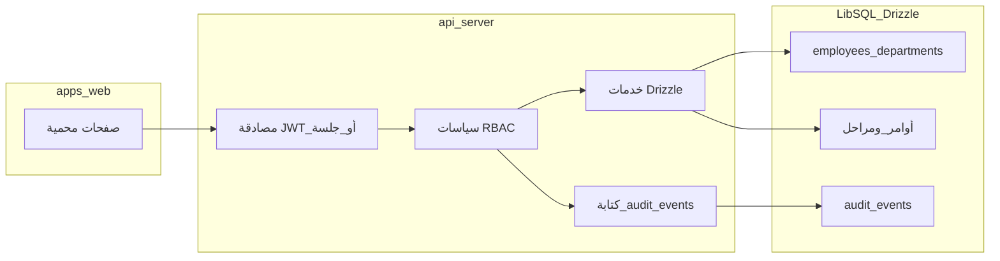

# خطة صلاحيات المستخدمين، ظهور البيانات، الإدخال، وسجل التحركات ومقارنة الأداء

## الوضع الحالي ذو الصلة

- الواجهة الرئيسية: [`apps/web`](apps/web) (React + Wouter) — لا توجد حاليًا جلسة مستخدم أو RBAC في الواجهة.
- البيانات المنظمة: [`lib/db/src/schema`](lib/db/src/schema) يحتوي [`employeesTable`](lib/db/src/schema/employees.ts) مرتبطة بـ [`departmentsTable` / `factoriesTable`](lib/db/src/schema/factoryCapacity.ts) — أساس جيد لربط المستخدم بالقسم والمصنع.
- الخلفية: [`artifacts/api-server`](artifacts/api-server) مسارات REST (`wooden`, `metal`, `factoryHub`, `employees`, …) بدون طبقة سياسات موحّدة موثّقة في الكود الذي تم مسحه.

## 1) نموذج الهوية والصلاحيات

**قرارات تصميم مقترحة**

- **مستخدم نظام** (`system_users`): معرف، بريد/اسم دخول، كلمة مرور مشفّرة أو ربط لاحق بمزود OAuth؛ حقل اختياري `employeeId` لربط السجل الوظيفي بـ `employees`.
- **أدوار** (`roles`): مثل `super_admin`, `factory_admin`, `department_lead`, `operator`, `viewer`.
- **صلاحيات دقيقة** (`permissions`) على شكل `resource` + `action` (مثلاً `wood_orders:read`, `wood_orders:write`, `daily_production:export`, `employees:read`).
- **ربط** `role_permissions` و `user_roles`؛ دعم **نطاق** اختياري: `factory_id` و/أو `department_id` لقيود صفّية (لا يرى القسم إلا ما يخص قسمه).

**فصل «عرض» عن «إدخال»**

- في الطبقة السياسية: دوال `can(user, action, resourceMeta)` حيث `resourceMeta` يتضمن مصنع/قسم/كيان محدد للتحقق من الإسناد.
- على مستوى API: وسيط موحّد بعد المصادقة يحقن `req.auth` ويرفض `403` قبل الوصول للـ controller.
- على مستوى الواجهة: إخفاء أو تعطيل عناصر الإدخال بناءً على نفس المصفوفة (مع اعتبار أن الحقيقة الأمنية على الخادم فقط).

### 1.1 تنفيذ عميق — المخطط والبيانات (كيف يُبنى في Drizzle)

- **`system_users`**: `id`, `email` فريد، `password_hash` (nullable إذا OAuth لاحقًا)، `employee_id` FK اختياري → [`employees`](lib/db/src/schema/employees.ts)، `is_active`, طوابع زمنية.
- **`roles`**: `slug` فريد (`super_admin` …)، تسميات عربية/إنجليزية للعرض فقط؛ المنطق يعتمد على `slug`.
- **`permissions`**: مفتاح نصي فريد بصيغة ثابتة مثل `namespace:verb` لتجنب تضارب المفتاح البشري مع المعرف.
- **`role_permissions`**, **`user_roles`**؛ في `user_roles` احفظ **`factory_id` و `department_id` اختياريين** لنفس المستخدم بعدة صفوف (مشرف على قسمين، أو مصنع كامل بدون قسم).
- **إندكسات**: `system_users(email)`؛ `user_roles(user_id)`؛ `audit_events` كما في الأسفل.
- **Seed/bootstrap**: ملف ترحيل + seed يقرأ من متغيرات بيئة لمرة (`BOOTSTRAP_ADMIN_EMAIL` / كلمة مرور) لإنشاء `super_admin`؛ لا تعيد إنشاء المستخدم في كل تشغيل.

### 1.2 تنفيذ عميق — المصادقة والتوكن (تسلسل تنفيذي)

1. **`POST /api/auth/login`**: التحقق من البريد/التنشيط، مقارنة Argon2id/bcrypt، إصدار `access_token` (JWT موقّع بسرّ ثابت من ENV، TTL قصير).
2. **اختياري `refresh_token`**: مخزن كجدول `sessions` مع `user_id`, hash للرمز، `expires_at` لإبطال جلسة من لوحة الإدارة.
3. **وسيط `authenticate`**: يقرأ `Authorization: Bearer`، يتحقق من التوقيع والمدة، يضع على `req.auth` على الأقل `{ userId, employeeId?, permissionKeys, scope }`.
4. **تحميل الصلاحيات**: إما في كل طلب من DB (أبسط للتغيير الفوري للأدوار) أو تضمين مجموعة مقيدة في JWT مع **`/api/auth/me`** لتحديث الواجهة — لا تضع في التوكن حقول حساسة أو قوائم طويلة جدًا بدون ضغط.

### 1.3 تنفيذ عميق — خوارزمية التحقق `assertPermission`

- الإدخال: `auth`, مثلًا `wood_orders:write`, و`meta` `{ factoryId?, departmentId?, resourceId? }`.
- الخطوات: (أ) رفض إذا المفتاح غير موجود في مجموعة المستخدم؛ (ب) إذا المستخدم ليس بلا نطاق (`super_admin`)، تحقق أن `meta.factoryId` ∈ نطاق المصانع المحصورة وأن `meta.departmentId` ∈ نطاق الأقسام (أو استنتج القسم من تحميل المورد من DB ثم طابقه).
- للمسارات التي لا تحمل قسمًا في الجسم: **حمّل الكيان أولًا بقراءة داخلية** (أو استعلام صف واحد) ثم طبّق النطاق قبل التعديل — هذا يمنع تعديل معرف أجنبي عن طريق تخمين الـ id.

### 1.4 تنفيذ عميق — الشفرة في الخادم

- ملفات وسيط في [`artifacts/api-server`](artifacts/api-server): `requireAuth`, `requirePermission('…')` قابلة للتسلسل؛ Controllers تبقى رفيعة.
- **اختبارات تلزم**: `401` بدون توكن، `403` صلاحية ناقصة، `403` قسم خاطئ بعد تحميل الكيان.

## 2) ظهور البيانات (Data visibility)

- **تصفية استعلامات Drizzle** حسب نطاق المستخدم (مصنع/أقسام متعددة للمدير، قسم واحد للمشغّل).
- توثيق **جدول سياسات** لكل مورد (أوامر خشب/معدن، إنتاج يومي، مشاريع): أي عمود أو مجموعة بيانات تحتاج صلاحية إضافية (مثلاً تكاليف أو معلومات عملاء) كحقول `sensitivity` مستقبلًا إن لزم.

### 2.1 تنفيذ عميق — أين تُلحق شروط Drizzle

- تمرير **`AuthContext`** إلى كل دالة في [`*.service.ts`](artifacts/api-server/src/services) (`listWoodOrders`, `getWoodOrder`, إلخ).
- بناء `where` مشروط: بدون نطاق للمدير المركزي؛ وإلا `inArray(department.id, allowedDepartmentIds)` أو ربط عبر join من أمر الشغل إلى قسم حسب المخطط الفعلي (قد لا يوجد `department_id` مباشر على الجدول — عندها النطاق يمر عبر `employee.department_id` فقط للمشغّل العادي).
- **عرض الحقول**: دالة `serializeWoodOrder(row, auth)` تحذف المفاتيح الحساسة إن لم يوجد مثل `orders:sensitive:read` — أسهل من استعلامات متعددة وتقلل خطأ التسريب عند إضافة عمود جديد.

### 2.2 تنفيذ عميق — مصفوفة مسارات ↔ صلاحيات

- ملف مركزي `permissions.manifest.ts` (أو تعليقات OpenAPI) يحدد لكل مسار: صلاحية GET مقابل POST/PATCH، وهل يتطلب تحقق نطاق بعد تحميل المورد (`PATCH /resource/:id`).

## 3) سجل التدقيق (Audit log)

**جدول مقترح** `audit_events` (append-only):

- `id`, `occurredAt`, `actorUserId`, `actorEmployeeId` (اختياري), `departmentId` (سياق القسم إن وُجد), `action` (مثل `CREATE`, `UPDATE`, `DELETE`, `EXPORT`, `LOGIN`, `LOGIN_FAILED`), `resourceType`, `resourceId`, `route` أو `endpoint`, `ip`, `userAgent`, `payloadSummary` (JSON مختصر أو hash)، واختياريًا `before`/`after` للكيانات الحساسة فقط لتجنب نمو حجم السجل.

**التطبيق**

- Middleware في [`artifacts/api-server/src/app.ts`](artifacts/api-server/src/routes) أو طبقة حول الخدمات لمسارات التعديل والاستيراد/التصدير.
- تسجيل **قرارات الرفض** (`403`/`401`) بحدّ معقول لمكافحة التسلل.

**شاشة السجل في الواجهة**

- مسار جديد محمي مثل `/audit-log` أو ضمن `/admin` (وفق خطة لوحة التحكم): جدول مع فلاتر (تاريخ، مستخدم، قسم، نوع الحدث، مورد)، تصدير CSV للمراجعين، وصفحة تفاصيل لحدث واحد.

### 3.1 تنفيذ عميق — نقطة كتابة واحدة وأداء

- دالة `recordAudit(event)` مشتركة؛ تجنّب نسخ لصق في كل controller عبر **wrapper** حول handlers أو طبقة رقيقة تلفّ `service.updateX` بعد النجاح.
- **المحتوى**: لا تخزّن جسم طلب كامل؛ قائمة الحقول المتغيرة + قيم مختصرة؛ لـ `EXPORT` سجّل العدد والنوع فقط.
- **المزامنة**: ابدأ بإدراج في نفس طلب HTTP؛ إذا ازداد الحمل، خطّط لـ outbox داخلي دون فقدان الحدث عند فشل الطلب التجاري.
- **`LOGIN_FAILED`**: لا تعُد للعميل «البريد غير موجود» مقابل «كلمة خاطئة»؛ الخادم يفرّق داخليًا فقط في السجل.

### 3.2 تنفيذ عميق — API وواجهة السجل

- `GET /api/audit-events` مع ترقيم وفلاتر زمنية؛ صلاحية `audit:read`؛ منع المستخدم العادي من رؤية أحداث مستخدمين آخرين إلا بصلاحية مراجعة.
- الواجهة: جدول مع Pagination؛ صفحة تفاصيل JSON مقروء؛ تصدير CSV من الخادم لتفادي آلاف الصفوف في المتصفح.

## 4) مقارنة أداء الأقسام والأفراد

**مصادر مقاييس (مرحلة أولى واقعية)**

- استخدام بيانات الإنتاج الموجودة: تحديثات المراحل، أوامر الشغل، وسجلات مثل [`metalStageLog`](lib/db/src/schema/metalStageLog.ts) حيث تنطبق على المعدن؛ وتعريف مقاييس موازية للخشب من [`woodenProductionStages`](lib/db/src/schema/woodenProductionStages.ts) أو الحقول في Factory Hub إن كانت مصدر الحقيقة.
- **أداء القسم**: تجميعات زمنية (يوم/أسبوع): عدد الوحدات المكتملة، متوسط زمن الدورة، معدل الإنجاز، نسبة التأخير (إن وُجدت تواريخ مستهدفة).
- **أداء الشخص**: يتطلّب ربط **`employeeId`** أو معرف المُدخل في أحداث الإدخال/المراحل؛ إن لم يُسجَّل اليوم، خطوة تمهيدية: إضافة حقول `updatedByUserId`/`completedByEmployeeId` على التحديثات الحرجة أو استنتاج من سجل التدقيق للإجراءات ذات الصلة.

**شاشات**

- `/performance/departments`: مخططات ومقارنة بين أقسام المصنع/المصانع مع نفس الفترة.
- `/performance/people`: جدول ترتيب + اتجاهات لكل موظف مرتبط بالبيانات؛ احترام صلاحيات العرض (لا يرى كل الأفراد إلا من له دور إداري).

### 4.1 تنفيذ عميق — خطوات تعريف المقاييس (قبل كتابة SQL)

1. **جرد الزمن**: تحديد عمود أو قاعدة «اكتمال المرحلة» للخشب والمعدن؛ إن كان المصدر Factory Hub JSON، توثيق المسار داخل `payload` المستخدم في الواجهة اليوم.
2. **تعريف كل مقياس صريحًا**: مثلاً `throughput_units` = مجموع وحدات مكتملة للمراحل التي تُعزى لقسم ما في الفترة؛ تجنّب متوسطات دورة بدون تعريف «بداية الأمر» و«نهاية القسم» لتفادي أرقام كاذبة.
3. **`on_time`**: يحتاج `due_date` أو SLA؛ إن لم يوجد في المخطط، تأجيل المقياس أو مصدر خارجي.

### 4.2 تنفيذ عميق — الحوسبة والتخزين المؤقت

- استعلام Drizzle مجمّع لكل `(department_id, day)` أو عرض SQL في LibSQL إن دُعم؛ للأحجام الكبيرة جدول **`performance_snapshots_daily`** يملأه مهمة مجدولة ليلًا.

### 4.3 تنفيذ عميق — الأفراد: مساران

- **مسار أ (سريع)**: تجميع من `audit_events` حيث `resourceType` يعكس تعديل مرحلة/كمية، مع `actorEmployeeId` عند التوفّر — جودة محدودة لكن بدون تغيير جداول الإنتاج.
- **مسار ب (دقيق)**: إضافة `updated_by_user_id` أو `completed_by_employee_id` على تحديثات المراحل الحرجة وربط `user_id` → `employee_id` في التقارير.

### 4.4 تنفيذ عميق — API والعزل

- نفس فلاتر النطاق في القسم 2؛ endpoint للأفراد يتطلّب صلاحية أعرض (`performance:people:read`) حتى لا يطلع عامل على زملائه خارج إطاره التنظيمي.

## 5) تسليم مرحلي مقترح

| المرحلة | المحتوى |
|---------|---------|
| M1 | جداول المستخدمين/الأدوار/الصلاحيات + تسجيل دخول + وسيط RBAC على عدد محدود من مسارات الكتابة |
| M2 | تطبيق نطاق مصنع/قسم على قراءة أوامر الشغل واللوحات |
| M3 | `audit_events` + تغطية مسارات التعديل والاستيراد/التصدير + شاشة السجل |
| M4 | لوحات مقارنة الأقسام ثم توسيع الأفراد بعد ربط المعرفات في البيانات التشغيلية |

### 5.1 ربط المراحل بمهام التنفيذ (todos)

| Todo في الواجهة | ما الذي يُنفَّذ عمليًا |
|-----------------|-------------------------|
| `schema-auth-rbac` | ملفات مخطط Drizzle + ترحيل + seed الأدوار والصلاحيات الأساسية؛ FK إلى `employees` حسب الحاجة. |
| `api-auth-middleware` | مسارات login/me، وسيط JWT، `requirePermission`، أول حماية على أهم مسارات الكتابة (Factory Hub / تحديث أوامر). |
| `scope-queries` | تمرير `auth` إلى [`wooden`](artifacts/api-server/src/services/wooden.service.ts) / [`metal`](artifacts/api-server/src/services/metal.service.ts) / [`factoryHub`](artifacts/api-server/src/services/factoryHub.service.ts) وتعديل كل `list*` و`get*` و`update*`. |
| `audit-table-hook` | جدول `audit_events`، إدراج من نقطة واحدة، فهارس، ثم تغطية تدريجية للمسارات + UI. |
| `performance-metrics` | تعريف المقاييس ثم `GET /api/performance/...` + صفحات [`apps/web`](apps/web) مع نفس العزل. |
| `web-guard-routes` | `/login`، حامل سياق مصادقة، حقن `Authorization` في [`apiJson`](apps/web/src/lib/api/client.ts)، إخفاء أزرار الإدخال حسب `/api/auth/me`. |

## مخاطر واعتماديات

- بدون تسجيل «من نفّذ العملية» على مستوى الكيانات التشغيلية، **مقارنة الأفراد** ستقتصر على ما يُستخرج من سجل التدقيق أو من تعيينات صريحة لاحقًا.
- الأداء: فهرسة `audit_events` على `(occurredAt, actorUserId, departmentId, resourceType)`؛ سياسة أرشفة/حذف منطقي بعد N شهر لتجنب نمو غير محكوم.
- **التزامن مع الواجهة**: بعد إدخال JWT يجب أن يمرّ التوكن على كل `fetch` إلى `/api` عبر عميل موحّد؛ خلاف ذلك ستظهر الواجهة «تعمل» بينما الخادم يرفض بصمت.
- **اختبارات**: وحدة لـ `assertPermission` + تكامل يغطي نطاق القسم على مسار واحد للقراءة ومسار واحد للكتابة على الأقل.
