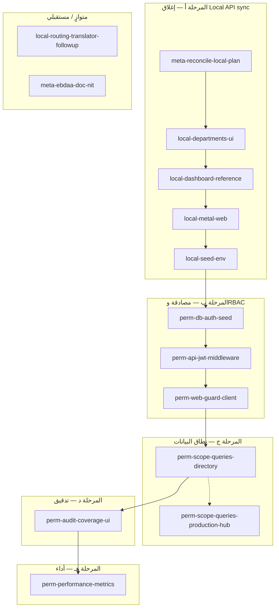

# خطة استكمال الخطط — تدفّق تنفيذ منطقي

تجمع هذه الخطة البنود المتبقية من:

- [Local API sync](local_api_sync_a2e2ca16.plan.md) (الـ YAML في ذلك الملف يعكس الآن تنفيذ المسارات والواجهة والـ todos المكتملة).
- [permissions-audit-performance](permissions-audit-performance_77343595.plan.md) — نطاق الصفوف على أوامر الإنتاج وصفوف hub منفَّذ عبر `factory_id` / `department_id`.

خطة [Ebdaa](ebdaa_data_integration_plan_30980b69.plan.md) مكتملة بحسب الـ todos؛ يبقى فقط ضبط توثيقي اختياري.

## التدفّق المنطقي (ترتيب التنفيذ)

**لماذا هذا الترتيب؟**

1. **مرحلة أ** لا تعتمد على المستخدمين؛ تكمل تجربة الويب والـ hub للجميع (بما فيها زوار التطوير).
2. **مرحلة ب** تضيف هوية حقيقية؛ بدونها لا معنى لعزل النطاق أو لتقارير «من فعل ماذا» بشكل موثوق.
3. **مرحلة ج** تبني على `req.auth`: الجزء الدليلي منجز؛ عزل أوامر الإنتاج وصفوف hub يفرض أعمدة مصنع/قسم وتصفية في الخدمات.
4. **مرحلة د** تستفيد من وجود مستخدم ومسمى فاعل في السجلات؛ يمكن بدء تسجيل جزئي أبكر لكن الواجهة والفلترة تكتمل بعد تثبيت الصلاحيات.
5. **مرحلة هـ** تحتاج تعريفات مقاييس وربما حقول إسناد؛ تُؤجَّل حتى لا تُعاد كتابة الاستعلامات بعد تغيير نطاق العرض.

## مرحلة أ — تفاصيل سريعة

| Todo                        | مرجع تقني                                                                                                                                                                                                                                    |
| --------------------------- | -------------------------------------------------------------------------------------------------------------------------------------------------------------------------------------------------------------------------------------------- |
| `local-departments-ui`      | [Sidebar.tsx](apps/web/src/components/layout/Sidebar.tsx)، [App.tsx](apps/web/src/App.tsx)، [factoryCapacity.ts](apps/web/src/data/fixtures/factoryCapacity.ts)، [employeeAssignments.ts](apps/web/src/data/fixtures/employeeAssignments.ts) |
| `local-dashboard-reference` | [Dashboard.tsx](apps/web/src/pages/Dashboard.tsx)، hooks [useFactoryHub.ts](apps/web/src/lib/api/hooks/useFactoryHub.ts)                                                                                                                     |
| `local-metal-web`           | [routes/metal.ts](artifacts/api-server/src/routes/metal.ts)، placeholder الويب تحت أوامر المعدّن                                                                                                                                             |
| `local-seed-env`            | [factoryHub routes](artifacts/api-server/src/routes/factoryHub.ts)، `.env.example`                                                                                                                                                           |

## مرحلة ب–هـ — مواءمة مع خطة الصلاحيات

| هذه الخطة                            | يقابله في [permissions-audit-performance](permissions-audit-performance_77343595.plan.md) |
| ------------------------------------- | ----------------------------------------------------------------------------------------- |
| `perm-db-auth-seed`                   | `schema-auth-rbac`                                                                        |
| `perm-api-jwt-middleware`             | `api-auth-middleware`                                                                     |
| `perm-web-guard-client`               | `web-guard-routes`                                                                        |
| `perm-scope-queries-directory`       | `scope-queries-directory`                                                                 |
| `perm-scope-queries-production-hub` | `scope-queries-production-hub`                                                            |
| `perm-audit-coverage-ui`              | `audit-table-hook`                                                                        |
| `perm-performance-metrics`            | `performance-metrics`                                                                     |

## مهام مستقبلية لا تعوق التسليم

- `**local-routing-translator-followup`:** محوّل كامل بين `routing_progress` ومراحل `wooden_production_stages` — مذكور في [legacy-adapter-factory-hub.md](docs/legacy-adapter-factory-hub.md) كعمل لاحق.
- `**meta-ebdaa-doc-nit`:** تحديث فقرات قديمة داخل ملف Ebdaa إن لزم.

## تعريف الجاهزية

- **Local sync «مكتمل عملياً»:** أقسام في القائمة ومسار واضح، معدّن له مسار ويب محدد، مرجع اللوحة متسق، seed و env موثّقة، وملف local_api_sync محدّث الانعكاس.
- **صلاحيات «مكتملة عملياً» (بحدود التعريف أعلاه):** دخول اختياري عبر JWT، حماية المسارات بالمفاتيح، نطاق صفّي على دليل السعة والموظفين ولأنشطة مقاييس الأفراد وسجل تدقيق ولوحات أداء وأوامر خشب/معدن وصفوف hub عند تعبئة مصنع/قسم.

بعد إنجاز كل todo، حدّث `status` هنا إلى `completed` (أو استخدم أداة المشروع في Cursor إن كانت تدير الحالة تلقائياً).