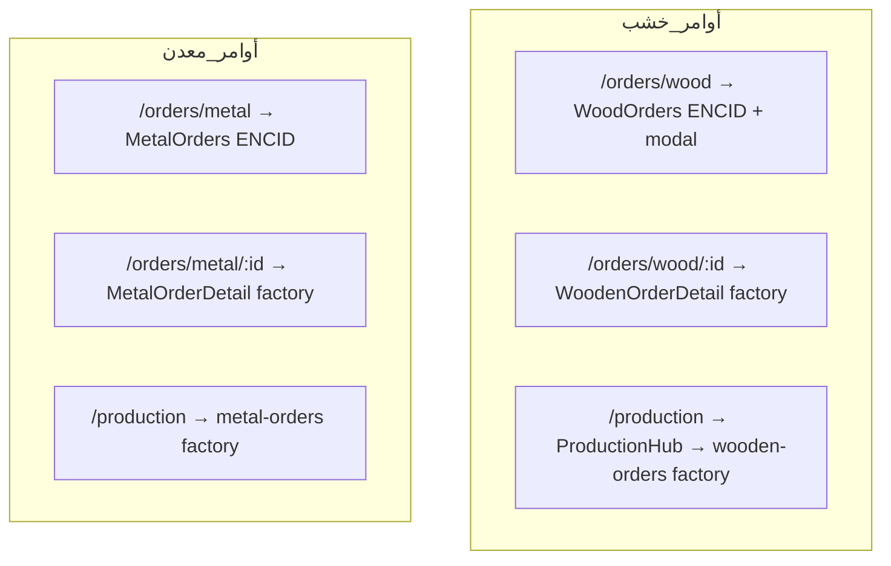
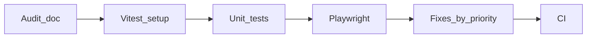

# فحص شامل + Audit + Unit/E2E Tests

## نتائج الفحص الحالي (ما زال غير مكتمل أو غير منسق)

### 1) تدويل (i18n) — **غير مكتمل**

| المنطقة | الحالة | الدليل |
|---------|--------|--------|
| القائمة والمسارات الجديدة | جزئي | مفاتيح `nav.productionHub` وغيرها في [`ar.ts`](apps/web/src/locales/ar.ts) / [`en.ts`](apps/web/src/locales/en.ts) |
| شاشات `src/factory/pages/*` | **غير مكتمل** | **0** استخدام لـ `useTranslation`؛ عشرات النصوص والـ `placeholder` عربية صلبة (مثال: [`projects-hub.tsx`](apps/web/src/factory/pages/projects-hub.tsx)) |
| لوحة ENCID القديمة | مكتمل نسبياً | [`Dashboard.tsx`](apps/web/src/pages/Dashboard.tsx) يستخدم `t()` لكن **غير مستخدمة** على `/` |

**الأثر:** تبديل اللغة إلى English لا يغيّر محتوى مركز الإنتاج، الاستيراد، القوى العاملة، مركز المشاريع، تفاصيل الأوامر (factory).

---

### 2) ازدواجية مسارات ومنطق — **تعارض منتج**



| التعارض | التوصية |
|---------|---------|
| مساران لتفاصيل الخشب (modal vs `:id`) | توحيد: إما ربط modal بـ `:id` أو إزالة route التفاصيل والاكتفاء بـ ENCID |
| ثلاث نقاط دخول لقوائم الأوامر (Sidebar + Production Hub + تبويبات) | توثيق «مصدر الحقيقة» في [`FACTORY_WEB_MERGE_PARITY.md`](docs/FACTORY_WEB_MERGE_PARITY.md) وتقليل التكرار في Sidebar أو Hub |
| `/` = factory dashboard؛ [`Dashboard.tsx`](apps/web/src/pages/Dashboard.tsx) يعتمد fixtures | دمج بطاقات ENCID في factory dashboard أو مسار `/dashboard/classic` |
| `/projects/joint` | ما زال Placeholder في [`App.tsx`](apps/web/src/App.tsx) |
| factory `planning.tsx` / `analytics.tsx` | **كود ميت** — مستبعد من [`tsconfig.app.json`](apps/web/tsconfig.app.json) وغير موصول بمسارات |

---

### 3) UI وإشعارات — **غير منسق**

- **نظاما Toast:** [`ToastProvider`](apps/web/src/components/ui/Toast.tsx) (ENCID) + [`Toaster`](apps/web/src/factory/components/ui/toaster.tsx) داخل [`FactorySurface`](apps/web/src/components/factory/FactorySurface.tsx) على الشاشات المنقولة.
- **نظاما تصميم:** `glass-panel` / `brand-*` (Layout) مقابل `factory-shadcn-scope` / متغيرات shadcn — انتقال بصري بين الصفحات.
- **ثيم industrial:** تعيين جزئي في [`factory-shadcn.css`](apps/web/src/factory/factory-shadcn.css)؛ يحتاج مراجعة تباين على الشاشات المدمجة.

---

### 4) صلاحيات وأمان عرض — **فجوة**

- [`ROUTE_REQUIRED_PERMISSION`](apps/web/src/lib/routePermissions.ts) يخفي عناصر Sidebar فقط ([`Sidebar.tsx`](apps/web/src/components/layout/Sidebar.tsx) سطر ~255).
- **لا حارس route** في [`Layout`](apps/web/src/components/layout/Layout.tsx): الوصول المباشر لـ `/import-export` ممكن حتى بدون صلاحية.
- مسارات بدون مفتاح: `/dev/tools` (ظاهر في القائمة بلا قيد في `routePermissions`).

---

### 5) Responsive — **جزئي، يحتاج تحقق منهجي**

| ما يعمل | ما يحتاج فحص |
|---------|----------------|
| `overflow-x-auto` على جداول factory ([`wooden-orders.tsx`](apps/web/src/factory/pages/wooden-orders.tsx)، [`metal-production.tsx`](apps/web/src/factory/pages/metal-production.tsx)) | [`projects-hub.tsx`](apps/web/src/factory/pages/projects-hub.tsx) (~1000+ سطر): شبكات معقدة، حوارات، أعمدة كثيرة على ~360px |
| `sm:` / `lg:` في عدة صفحات factory | Sidebar ثابت `mr-64` في Layout — على عرض ضيق قد يضيّق المحتوى (لا overlay mobile واضح لكل الحالات) |
| `FactorySurface` أضاف `overflow-x-auto` | تبويبات Production Hub + Pie charts على شاشات صغيرة |

**لا توجد اختبارات responsive آلية حالياً** في المستودع (0 ملفات `*.test.*` / `*.spec.*`).

---

### 6) بنية الدمج التقنية — **ديون**

- ~40 مكوّن UI في `src/factory/components/ui` **مستبعدة من `tsc`** عبر `exclude` — خطر إذا استُوردت لاحقاً دون dependencies.
- لا CI يشغّل `web` build/tests بعد الدمج (يُضاف في الخطة).

---

## خطة التنفيذ

### المرحلة A — تقرير Audit رسمي (قابل للمتابعة)

إنشاء [`docs/WEB_UI_AUDIT.md`](docs/WEB_UI_AUDIT.md) يتضمن:

1. **مصفوفة مسار × مصدر UI × API × صلاحية × i18n × responsive** (كل مسار في [`App.tsx`](apps/web/src/App.tsx)).
2. **قائمة تعارض** (الجدول أعلاه) بحالة: مفتوح / مقرر / مُصلح.
3. **Checklist يدوي responsive** (360 / 768 / 1280 / 1920) لكل مسار factory + ENCID حرج.
4. تحديث [`FACTORY_WEB_MERGE_PARITY.md`](docs/FACTORY_WEB_MERGE_PARITY.md) بقرارات التوحيد النهائية (خشب `:id` vs modal، dashboard).

---

### المرحلة B — إعداد Vitest + Testing Library

في [`apps/web`](apps/web):

- إضافة `vitest`, `@vitest/coverage-v8`, `jsdom`, `@testing-library/react`, `@testing-library/user-event`, `@testing-library/jest-dom`.
- [`vite.config.ts`](apps/web/vite.config.ts): `test: { environment: "jsdom", setupFiles: ["./src/test/setup.ts"], include: ["src/**/*.{test,spec}.{ts,tsx}"] }`.
- سكربت: `"test": "vitest run"`, `"test:watch": "vitest"`.

**اختبارات unit/integration مقترحة (أولوية):**

| الملف | ما يُختبر |
|-------|-----------|
| `src/lib/routePermissions.test.ts` | كل مسار في Sidebar له مفتاح؛ مفاتيح جديدة موجودة في catalog |
| `src/i18n/localeParity.test.ts` | تطابق مفاتيح `ar`/`en` (شجرة مسطحة) |
| `src/i18n/resolveMessage.test.ts` | سقوط آمن عند مفتاح ناقص |
| `src/components/routing/LegacyFactoryRedirects.test.tsx` | `/metal/orders/:id` → `/orders/metal/:id` |
| `src/factory/lib/cutlist-csv.test.ts` | parse/format cutlist |
| `src/components/layout/Sidebar.permissions.test.tsx` | إخفاء عنصر عند غياب صلاحية (mock PermissionContext) |
| `src/lib/uiTheme.test.ts` | `readStoredUiTheme` / `applyUiThemeToDocument` |

---

### المرحلة C — Playwright E2E + responsive

- حزمة `apps/web` أو جذر: `@playwright/test`.
- [`apps/web/e2e/`](apps/web/e2e/) مع `playwright.config.ts` (baseURL `http://127.0.0.1:5173`).
- **قبل التشغيل:** تشغيل API + `pnpm --filter web run dev` (أو `webServer` في config).

**سيناريوهات E2E:**

| Spec | تغطية |
|------|--------|
| `navigation.spec.ts` | تحميل `/`, `/production`, `/import-export`, `/projects/hub` بدون 404 |
| `legacy-redirects.spec.ts` | `/wooden/orders` → `/orders/wood` |
| `i18n-toggle.spec.ts` | تبديل LTR: نص القائمة يتغير (على صفحة ENCID) |
| `responsive.spec.ts` | viewports 375×812, 768×1024, 1280×720 — لقطات + assert عدم `document.documentElement.scrollWidth > innerWidth` (لا overflow أفقي عام) |
| `permissions.spec.ts` | (اختياري مع mock API) إخفاء عنصر sidebar |

تخزين snapshots في `e2e/__screenshots__/` للمراجعة البصرية عند CI.

---

### المرحلة D — إصلاحات حسب الأولوية (بعد الاختبارات الحمراء)

1. **Route guard** — مكوّن `RequirePermission` يلفّ مسارات في [`App.tsx`](apps/web/src/App.tsx) يطابق `ROUTE_REQUIRED_PERMISSION`.
2. **توحيد Toast** — جسر `useFactoryToast` → ENCID `ToastProvider` أو العكس؛ إزالة Toaster المزدوج من FactorySurface عند الاكتمال.
3. **i18n factory** — ملف `locales/factory/ar.ts` + `en.ts` و hook `useFactoryT`؛ ترحيل شاشة بشاشة (البدء: `import-export`, `production-hub`, `dashboard`).
4. **توحيد أوامر الخشب** — قرار منتج ثم تنفيذ (modal + deep link أو route فقط).
5. **Responsive fixes** — من نتائج Playwright: `projects-hub` grids، Layout `mainGutter` mobile (drawer/overlay).
6. **إكمال `/projects/joint`** أو redirect إلى `/projects/hub`.

---

### المرحلة E — CI

في workflow (مثلاً `.github/workflows/web.yml` إن وُجد أو جديد):

```yaml
- pnpm --filter web run build
- pnpm --filter web run test
- pnpm exec playwright test (مع API mock أو خدمة test)
```

---

## ترتيب التنفيذ المقترح



---

## معايير «مكتمل»

- كل مسار في App له صف في audit بحالة **OK** أو **مُقرر/مؤجل** موثّق.
- `pnpm --filter web run test` أخضر؛ تغطية ≥80% للوحدات الحرجة (`routePermissions`, i18n parity, redirects, cutlist).
- Playwright: مسارات رئيسية + 3 viewports بدون overflow أفقي حرج.
- تبديل ar/en على شاشة factory واحدة على الأقل يُظهر نصوصاً مترجمة (بعد مرحلة D3).

---

## ملاحظة على نطاق هذه الخطة

هذه خطة **فحص واختبار وإصلاح**؛ لا تعدّل ملف [`.cursor/plans/مراجعة_صفحات_المشروع_c46d6064.plan.md`](.cursor/plans/مراجعة_صفحات_المشروع_c46d6064.plan.md).
