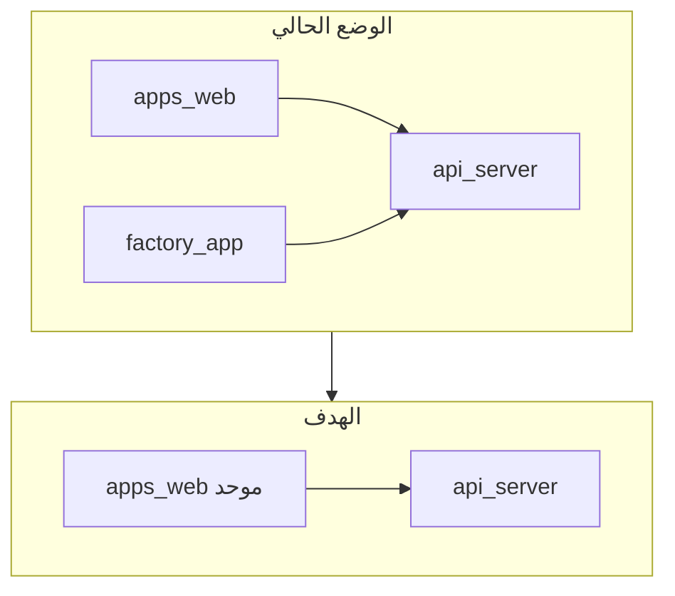

# توحيد العمل — دمج `factory-app` داخل `apps/web` (خطة تنفيذ احترافية)

## الهدف والمبدأ

- **التطبيق الموحّد:** [`apps/web`](apps/web) يصبح الواجهة الوحيدة المعتمدة للمستخدمين.
- **المصدر المدمج:** [`artifacts/factory-app`](artifacts/factory-app) يُعامل كمستودع ميزات يُنقل **الكود والسلوك** منه دون الإبقاء على تطبيقين منفصلين للإنتاج.
- **الخلفية:** لا تغيير معماري على [`artifacts/api-server`](artifacts/api-server) إلا إذا ظهرت فجوات أثناء الدمج (نفس عقد OpenAPI / [`lib/api-client-react`](lib/api-client-react)).

---

## الفروقات الحرجة (تؤثّر على التخطيط)

| المحور | `apps/web` | `factory-app` |
|--------|------------|---------------|
| عميل API | [`apiJson`/أنواع يدوية](apps/web/src/lib/api/client.ts) | hooks مولّدة من [`@workspace/api-client-react`](lib/api-client-react) |
| مكوّنات UI | تصميم ENCID + مكوّنات خاصة | طبقة shadcn/Radix ضخمة تحت [`factory-app/src/components/ui`](artifacts/factory-app/src/components/ui) |
| التخطيط | [`Layout` + `Sidebar`](apps/web/src/components/layout/Sidebar.tsx) + i18n | [`AppLayout` + قائمة عربية ثابتة](artifacts/factory-app/src/components/layout.tsx) |
| مسارات الطلبات | `/orders/metal`، `/orders/wood` | `/metal/orders`، `/wooden/orders` و `:id` |
| ميزات غير موجودة كمسارات في web | — | **`/production`** (Production Hub مع تبويبات)، **`/import-export`**، **`/workforce`**، **`/projects`** (Projects Hub كبير)، لوحة تحكم تنفذ بنفس hooks المولّدة |

---

## معايير عرضية إلزامية (ضمن الخطة والمراجعة)

تُنفَّذ **مع كل صفحة** أثناء النقل أو الدمج، وتُوثَّق في قائمة تحقق قبل إغلاق المرحلة.

### أ) الترجمة وتكافؤ المحتوى

- **ممنوع** ترك نصوص واجهة للمستخدم معرّضة مباشرة (عربي/إنجليزي صلب) في المكوّنات المنقولة؛ كل العناوين، الأزرار، الرسائل، `placeholder`، `aria-label`، نصوص الفراغ/الخطأ/التحميل يمر عبر [`I18nContext`](apps/web/src/context/I18nContext.tsx) و [`locales/ar.ts`](apps/web/src/locales/ar.ts) / [`locales/en.ts`](apps/web/src/locales/en.ts).
- **بيانات ديناميكية من API:** لا تُترجم أو تُعرَض كما هي إن كانت مفاتيح تجارية؛ أما الأوصاف الثابتة المملوكة للمنتج فتُدوَّل.
- **تحقق:** تطبيق تبديل اللغة على الصفحة؛ التأكد أن **جميع** السلاسل الظاهرة تتغير وأن مفاتيح `ar` و`en` موجودة ومتوازية (لا مفتاح ناقص يسبب سقوطاً لـ `resolveMessage`).
- **أسماء مراحل/حالات من الخادم:** إن بقيت بالعربية فقط في المصدر، يُوثَّق قرار المنتج (إبقاء كقيمة بيانات) مقابل إضافة خريطة ترجمة في الطبقة العرضية.

### ب) عدم التعارض والتناسق

- **مصدر واحد للحقيقة:** مسار واحد لكل شاشة بعد الدمج؛ لا ازدواج تنقل أو منطق متناقض لنفس الإجراء (مثلاً زرّان لإنشاء أمر بنفس السياق بسلوك مختلف).
- **Toast / إشعارات:** عدم خلط رسائل من نظامين مختلفين دون قاعدة واضحة (توحيد مكوّن الإشعار بعد الدمج).
- **RTL/LTR:** التحقق من [`DirectionContext`](apps/web/src/context/DirectionContext.tsx): انعكاس آمن للتخطيطات، عدم كسر جداول أو محاور رسوم بسبب اتجاه ثابت مخفي في CSS.

### ج) الألوان والنظام البصري

- **محاذاة مع رموز ENCID:** تفضيل متغيرات CSS/رموز العلامة في [`index.css`](apps/web/src/index.css) و [`uiTheme`](apps/web/src/lib/uiTheme.ts) (أو ما يعادلها) على ألوان hex/`oklch` مبعثرة في الشاشات المنقولة من factory؛ إعادة ربط ألوان الرسوم (Recharts/Pie) بهذه الرموز حيث أمكن.
- **وضع فاتح/داكن:** إن وُجد تبديل ثيم، التحقق من تباين النصوص والحدود في الشاشات المدمجة (بطاقات shadcn + لوحات ENCID).
- **حالة واحدة للعلامة:** تجنّب خلط «Executive Suite» بلونية مستقلة دون توثيق؛ الهدف مظهر منتج واحد.

### د) التوافق مع الشاشات (Responsive)

- اختبار يدوي على عرض ضيق (≈360px)، متوسط (tablet)، وwide desktop؛ التأكد من: القائمة/الحوافز، الجداول (تمرير أفقي أو إخفاء أعمدة حسب النمط الحالي في [`DataTable`](apps/web/src/components/data-table/DataTable.tsx))، والـ modals بلا قطع.
- **ارتفاع الشاشة:** التمرير داخل `main` في [`Layout`](apps/web/src/components/layout/Layout.tsx) دون فقدان رؤوس أو أزرار ثابتة ظرفياً.
- **لمسة / لوحة مفاتيح:** أحجام مناطق لمس مقبولة، تركيز واضح للعناصر التفاعلية.

---

## المرحلة 0 — مصفوفة مطابقة وقرارات منتج

قبل نقل أي ملف:

1. إنشاء جدول **صفحة factory → قرار**: *نقل كما هو* | *دمج مع صفحة web الحالية* | *إحلال web وإيقاف factory*.
2. توثيق **المسارات النهائية** (مثال مقترح — يُثبّت مع الفريق):

| ميزة factory | مسار مقترح في `apps/web` | ملاحظة |
|--------------|--------------------------|--------|
| Production Hub | `/production` أو `/hub/production` | تجمع خشب/معدن/المشتركة؛ يرتبط ببنيات `Sidebar` الجديدة |
| Projects Hub | `/projects/hub` | يتفادى التعارض مع `/projects/new` و`/projects/joint` الحالية |
| Import/Export | `/import-export` | صلاحية جديدة في [`routePermissions.ts`](apps/web/src/lib/routePermissions.ts) |
| Workforce | `/workforce` | تمييزه عن `/performance/people` إن بقيَا معاً مؤقتاً |
| تفاصيل أمر معدن/خشب (factory) | إما توحيد مع `/orders/*` أو إبقاء `/metal/orders/:id` كـ redirect | **قرار منتج** لتجنب مسارين لنفس الكيان |

3. **Project Atlas** [`/__internal/project-atlas`](artifacts/factory-app/src/pages/internal/project-atlas.tsx): نقل شرط `DEV`/`VITE_SHOW_PROJECT_ATLAS` إلى web إن بقي مطلوباً فقط.

---

## المرحلة 1 — محاذاة الأدوات والتبعيات

1. إضافة **`@workspace/api-client-react`** إلى [`apps/web/package.json`](apps/web/package.json) (الـ [`QueryClientProvider`](apps/web/src/main.tsx) موجود مسبقاً).
2. **إصدارات React/Recharts:** factory يستخدم `recharts@2` وواجهات مختلفة عن `recharts@3` في web — اختبر التوافق أو ثبّت إصداراً موحّداً عبر الـ workspace catalog لتفادي مكوّنين لرسم واحد.
3. **Vite:** محاذاة [بروكسي `/api`](apps/web/vite.config.ts) مع [إعدادات factory](artifacts/factory-app/vite.config.ts) (اختياري: `BASE_PATH`/`PORT` لنشر موحّد).
4. **مسارات الاستيراد:** إضافة alias (مثلاً `@factory-ui`) يشير مؤقتاً إلى مجلد منقول من factory لتسريع النقل، ثم تدريجياً دمج التسمية تحت `apps/web/src`.

---

## المرحلة 2 — القشرة: مسارات، قائمة، صلاحيات، تدويل

1. تسجيل المسارات الجديدة في [`App.tsx`](apps/web/src/App.tsx).
2. إضافة عناصر في [`Sidebar.tsx`](apps/web/src/components/layout/Sidebar.tsx) ومفاتيح في [`locales/ar.ts`](apps/web/src/locales/ar.ts) و [`locales/en.ts`](apps/web/src/locales/en.ts).
3. توسيع [`ROUTE_REQUIRED_PERMISSION`](apps/web/src/lib/routePermissions.ts) لكل مسار جديد (مثل `import:view`، `workforce:view`، `production:hub:view` — الأسماء تُستطّل من [`permissionCatalog`](lib/db/src/permissionCatalog.ts) إن لزم).
4. التأكد أن **عرض الصفحة** يُحترم في [`Layout`](apps/web/src/components/layout/Layout.tsx) / `PermissionContext` بنفس منطق إخفاء القائمة.
5. **قبل اعتبار المسار جاهزاً:** تغطية تدويل كاملة لعناوين القائمة والمسارات الجديدة وفق قسم «معايير عرضية إلزامية».

---

## المرحلة 3 — نقل الشاشات ذات القيمة الفريدة (منخفض تعارض أولاً)

1. **`import-export`** — يعتمد على hooks الاست import؛ نقل مع تكييف Toast (مثلاً دمج Sonner مع نظام Toast الحالي أو توحيد على مكوّن واحد).
2. **`workforce`** — نقل ثم ربط الصلاحيات.
3. **`production-hub`** مع [`metal-production`](artifacts/factory-app/src/pages/metal-production.tsx)، [`wooden-production`](artifacts/factory-app/src/pages/wooden-production.tsx)، [`shared-projects`](artifacts/factory-app/src/pages/shared-projects.tsx)، وقوائم [`metal-orders`/`wooden-orders`](artifacts/factory-app/src/pages) إن كانت مدمجة في الـ Hub وليس لها مسارات منفصلة في web.
4. **`projects-hub`** — حجم كبير (Cutlist، مراحل، إنشاء أوامر): نقل كوحدة مع تبعيات [`cutlist-csv`](artifacts/factory-app/src/lib/cutlist-csv.ts) والمكوّنات [`PieBulletLegend`](artifacts/factory-app/src/components/PieBulletLegend.tsx) إلخ.

في كل خطوة: استبدال `@/` بمسارات `apps/web` أو alias موحّد، وإزالة الاعتماد على `@replit/*` من [vite.config](artifacts/factory-app/vite.config.ts) في البناء النهائي لـ web (تبقى اختيارية للتطوير فقط إن رغبتم).

---

## المرحلة 4 — دمج التكرار والإحلال

1. **لوحة التحكم:** مقارنة [`Dashboard.tsx`](apps/web/src/pages/Dashboard.tsx) مع [`dashboard.tsx`](artifacts/factory-app/src/pages/dashboard.tsx) — اختيار منطق مصدر البيانات (يفضّل hooks المولّدة بعد المرحلة 1)، ودمج الرسوم/البطاقات الناقصة.
2. **التخطيط / التحليلات:** تقييم تعارض [`PlanningKpi`](apps/web/src/pages/PlanningKpi.tsx) مع [`planning.tsx`](artifacts/factory-app/src/pages/planning.tsx) و [`Analytics.tsx`](apps/web/src/pages/Analytics.tsx) مع [`analytics.tsx`](artifacts/factory-app/src/pages/analytics.tsx) — صفحة واحدة أو تبويبات.
3. **أوامر العمل:** إما إحلال صفحات web بتفاصيل factory (`/metal/orders/:id`) أو العكس، مع **روابط قديمة → redirect** في `Switch` لتجنّك كسر المفضلات.
4. **Toast والأنماط:** تهدئة الازدواجية البصرية تدريجياً (خياران: الحفاظ على شاشات «Executive» كفرع تصميم تحت namespace CSS، أو إعادة غلاف المكوّنات بلمسات ENCID) مع **توحيد لوحة الألوان** (لا تخريج ألوان مخططات دون ربط بالرموز المعتمدة إن أمكن).
5. **مراجعة شاملة للتعارض:** مسار واحد لكل تدفق، سلوك أزرار متسق، وعدم ازدواج إشعارات أو تسميات لنفس الإجراء.

---

## المرحلة 5 — إيقاف `factory-app` والتوثيق

1. تحديث [README](README.md): أمر تشغيل واحد (`pnpm --filter web run dev`) + API.
2. إزالة أو تعليق **`dev:wood-dashboard`** / أي سكربت يشير إلى factory من [جذر package.json](package.json) إن وُجد.
3. CI/نشر: pipeline واحد لـ `apps/web` فقط.
4. هيكلة المستودع: إما حذف [`artifacts/factory-app`](artifacts/factory-app) بعد الدمج الكامل أو الإبقاء كأرشيف فرعي غير مُبنى مع ملاحقة تقنية.

---

## ضمان الجودة أثناء التنفيذ

- **اختبارات يدوية:** كل مسار جديد + صلاحية ممنوعة + تبديل لغة كامل للصفحة + RTL/LTR.
- **شاشات:** نطاق عرض ضيق/متوسط/واسع كما في قسم «معايير عرضية إلزامية».
- **`pnpm --filter web run build`** في نهاية كل مرحلة كبيرة.
- تتبع استدعاءات API عبر الشبكة مقابل [`openapi.yaml`](lib/api-spec/openapi.yaml) عند إضافة شاشات جديدة.

---

## ملحق — قالب مراجعة سريع (بعد الدمج)

لكل شاشة موحّدة: **مسار**؛ **تدويل كامل** (لا نص صلب؛ مفاتيح `ar`/`en` متطابقة)؛ **أزرار وروابط**؛ **mutations**؛ **صلاحيات**؛ **endpoints**؛ **ألوان/ثيم** متسقة مع رموز التطبيق؛ **Responsive + RTL** بلا تعارض بصري أو منطقي.
