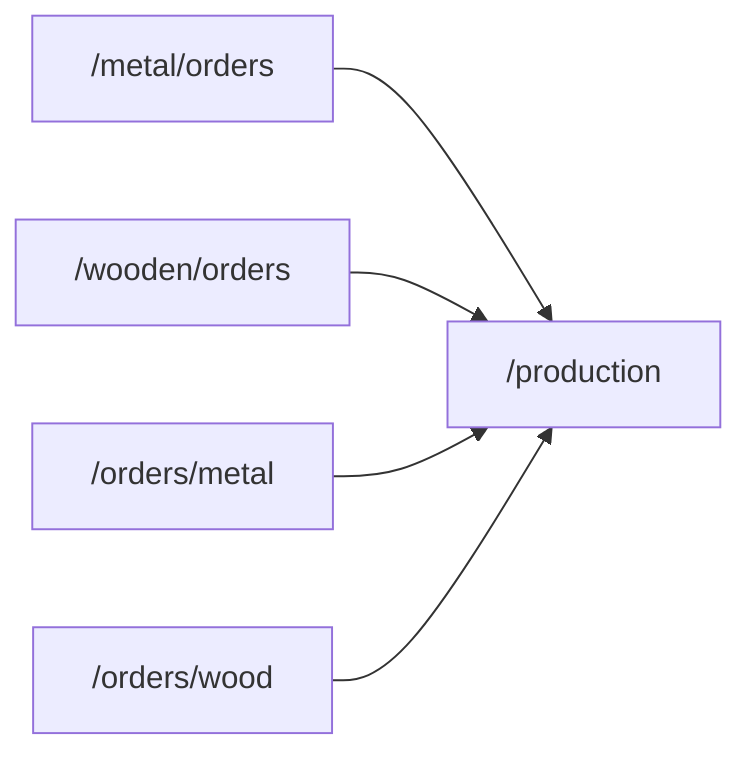

# Site information architecture (post-unification)

## Primary flows

| User intent | Canonical path | Notes |
|------------|----------------|-------|
| Executive snapshot | `/` | Live KPIs; link to analytics for operational fixtures |
| Metal/wood order lists & shop floor | `/production` | Query: `?factory=metal|wood&view=orders|production` |
| Work order detail | `/orders/metal/:id`, `/orders/wood/:id` | Unchanged |
| Legacy list bookmarks | `/orders/metal`, `/orders/wood` | Redirect to production hub (permission: `orders:*:view`) |
| Operational analytics (fixtures + hub) | `/analytics`, `/analytics/wood`, `/analytics/metal` | Includes relocated home “operational” block |

## Redirect chain (legacy → current)

## Sidebar (top-level)

1. Dashboard `/`
2. Production hub `/production`
3. Departments, daily production groups, projects group, workforce, planning, workflow, equipment, analytics group, import/export, audit/performance group, project analytics, settings group, dev map.

Removed as standalone nav items: **Metal orders** and **Wood orders** links (use hub).

## Permission notes

Roles with `orders:metal:view` / `orders:wood:view` must also have `production:hub:view` (added to `department_lead` and `operator` presets) so redirects do not land on a denied page.

## Related docs

- [FACTORY_WEB_MERGE_PARITY.md](FACTORY_WEB_MERGE_PARITY.md)
- [WEB_UI_AUDIT.md](WEB_UI_AUDIT.md)
